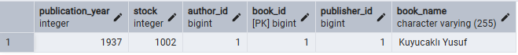

## Library Management System (JPA/Hibernate + PostgreSQL)

This project is a simple library management system handling books, authors, categories, publishers, and borrowing operations. It uses JPA (Hibernate) and runs on PostgreSQL.

### Contents
- Purpose and scope
- Project requirements
- Setup and run
- Database schema and tables
- Sample data
- Screenshots

### Purpose and Scope
- Entities: `book`, `author`, `category`, `publisher`, `book_borrowing` and their relations.
- Relations:
  - Author (One) ↔ Book (Many)
  - Publisher (One) ↔ Book (Many)
  - Category (Many) ↔ Book (Many) — join table: `category_book`
  - Book (One) ↔ BookBorrowing (Many)

### Requirements
- Java 21
- Maven
- PostgreSQL 14+

### Setup and Run
1) Create the PostgreSQL database:
```sql
CREATE DATABASE library_management_system;
```

2) Update connection properties in `src/main/resources/META-INF/persistence.xml`:
- URL: `jdbc:postgresql://localhost:5432/library_management_system`
- Username: `postgres`
- Password: `your password`

3) Maven dependencies
- Dependencies already exist in `pom.xml`


4) Entity package mapping
- In Hibernate 6.5 and later, entity classes must be explicitly declared in the `persistence.xml` file.

5) Schema generation strategy
- For development: `hibernate.hbm2ddl.auto = create`
- Alternatively: `update`

### Database Schema and Tables
Expected tables:
- `author`
- `publisher`
- `book`
- `category`
- `book_borrowing`
- `category_book` (join table)

Relation notes:
- `book.author_id` → `author.author_id` (ManyToOne)
- `book.publisher_id` → `publisher.publisher_id` (ManyToOne)
- `category_book` connects `book` and `category` (ManyToMany)
- `book_borrowing.book_id` → `book.book_id` (ManyToOne)

### Sample Data
When `LibraryManagementSystemMain` runs, it inserts sample data. `book_borrowing.returnDate` is `null` initially; set it on return.

### Screenshots

- `author`
- 
- `publisher`
- 
- `book`
- 
- `category`
- 
- `book_borrowing`
- 
- `category_book`
- 


## Kütüphane Yönetim Sistemi (JPA/Hibernate + PostgreSQL)

Bu proje, kitap, yazar, kategori, yayınevi ve ödünç alma süreçlerini yöneten basit bir kütüphane yönetim sistemidir. JPA (Hibernate) ile PostgreSQL üzerinde çalışır.

### İçerik
- Amaç ve kapsam
- Proje gereksinimleri
- Kurulum ve çalıştırma
- Veritabanı şema ve tablolar
- Test için örnek veriler
- Ekran görüntüleri

### Amaç ve Kapsam
- Kitap (`book`), Yazar (`author`), Kategori (`category`), Yayınevi (`publisher`), Ödünç Alma (`book_borrowing`) tablolarını ve ilişkilerini içerir.
- İlişkiler:
  - Yazar (One) ↔ Kitap (Many)
  - Yayınevi (One) ↔ Kitap (Many)
  - Kategori (Many) ↔ Kitap (Many) — join tablo: `category_book`
  - Kitap (One) ↔ Ödünç Alma (Many)

### Proje Gereksinimleri
- Java 21
- Maven
- PostgreSQL 14+

### Kurulum ve Çalıştırma
1) PostgreSQL veritabanını oluşturun:
```sql
CREATE DATABASE library_management_system;
```

2) `src/main/resources/META-INF/persistence.xml` içinde bağlantı bilgilerini kendi ortamınıza göre güncelleyin:
- URL: `jdbc:postgresql://localhost:5432/library_management_system`
- Kullanıcı adı: `postgres`
- Şifre: `şifreniz`

3) Maven bağımlılıkları
- `pom.xml` içerisinde bağımlılıklar zaten mevcut.


4) Entity sınıfları paketi
- Hibernate 6.5 ve sonrasında,`persistence.xml` dosyasında entity sınıflarının açıkça belirtilmesi gerekmektedir.

5) Şema oluşturma stratejisi
- Geliştirme için: `hibernate.hbm2ddl.auto = create`
- Alternatif: `update`


### Veritabanı Şema ve Tablolar
Oluşması beklenen tablolar:
- `author`
- `publisher`
- `book`
- `category`
- `book_borrowing`
- `category_book` (ManyToMany join tablosu)


İlişki notları:
- `book.author_id` → `author.author_id` (ManyToOne)
- `book.publisher_id` → `publisher.publisher_id` (ManyToOne)
- `category_book` join tablosu ile `book` ve `category` arasında ManyToMany
- `book_borrowing.book_id` → `book.book_id` (ManyToOne)

### Test İçin Örnek Veriler
`LibraryManagementSystemMain` çalıştığında örnek veri eklenir. `book_borrowing.returnDate` alanı ilk eklemede `null` bırakılır; iade edildiğinde tarih güncelleyebilirsiniz.

### Ekran Görüntüleri

- `author`
- 
- `publisher`
- 
- `book`
- 
- `category`
- 
- `book_borrowing`
- 
- `category_book`
- 


